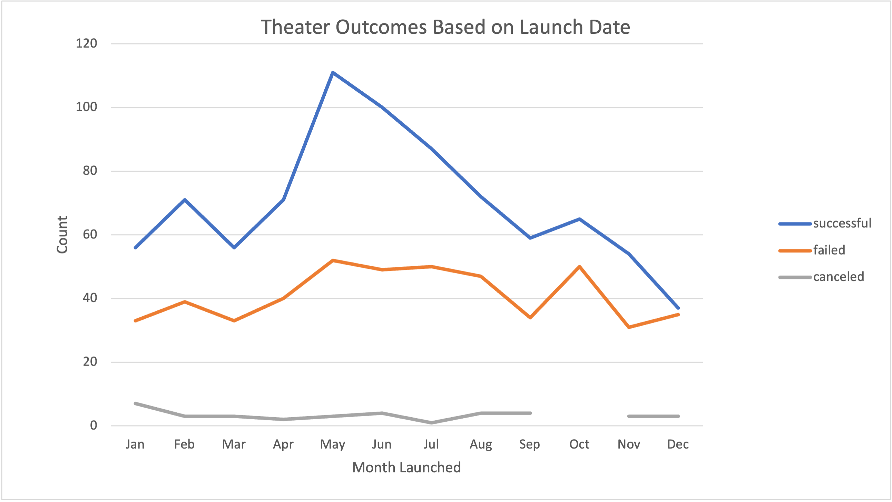
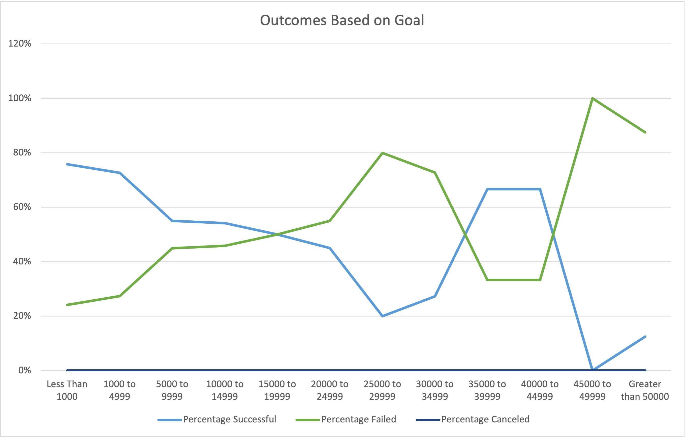

# Kickstarting with Excel

## Overview of Project
We used Kickstart campaign [data](Kickstarter_Challenge.xlsx) to identify the impact of goal size and launch date on the successful, failed, and canceled outcomes on each campaign.

### Purpose
We wanted to discover if fundraisers were more likely to succeed or fail based on their launch date, and the size of the goal.

## Analysis and Challenges

### Analysis of Outcomes Based on Launch Date
- Outcomes for each month where calculated by adding successful, failed, and canceled outcomes.
- Source in `Kickstarter` sheet and analysis in `Theater Outcomes by Launch Date` sheet of [Kickstarter_Challenge.xlsx](Kickstarter_Challenge.xlsx)
- 

### Analysis of Outcomes Based on Goals
- Outcomes based on goal ($ total)
- Source in `Kickstarter` sheet and analysis in `Outcome Based on Goals` sheet of [Kickstarter_Challenge.xlsx](Kickstarter_Challenge.xlsx)
- count=`COUNTIFS(goal,range,outcome, {"successful"|"failed","canceled"}, subcategory, "plays")`
- 

### Challenges and Difficulties Encountered
- Creating the pivot table to filter the outcomes results was challenging since any preset filters would not transfer over to the pivot table. The solution was to move the outcomes initially under the filter section on the pivot table, filter the outcomes and then move it back under columns. 
- Excel functions' syntax is prone to errors, e.g. referencing the right column in another sheet, commas, quotations, etc.

## Results

- What are two conclusions you can draw about the Outcomes based on Launch Date?
  - There is an increase in successful counts in the spring, and a decrease in the fall
  - The count of failed theater campaigns was constant across the year 

- What can you conclude about the Outcomes based on Goals?
  - There was an increase in the percent of successful play campaigns in goals between $35K-$45K
  - The larger the goal size, the higher the failure percentage.

- What are some limitations of this dataset?
  - Cannot explain the increase of count of successful donations in the Spring.

- What are some other possible tables and/or graphs that we could create?
  - We could compare the success of plays based on the average donations across different goal sizes.
